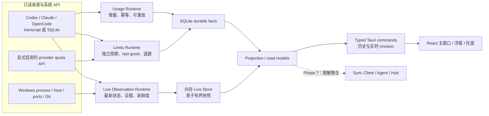

# Tokenometer 重构架构与 AI 开发交接

> 文档状态：架构基线 v2（规范仍有效；Phase 0 与 Phase 1 已实现，当前检查点见 [`docs/PHASE_1_HANDOFF.md`](docs/PHASE_1_HANDOFF.md)）
>
> 基线日期：2026-08-08
>
> 目标平台：Windows 10 2004（build 19041）及以上，首发 x64
>
> 目标技术栈：React + TypeScript + Vite + Tauri 2；Windows 渲染器为 WebView2

## 0. 如何使用本文档

本文档是清空旧实现后的架构规范。后续 AI 在创建或修改代码前必须先读
[`docs/PHASE_1_HANDOFF.md`](docs/PHASE_1_HANDOFF.md) 了解当前检查点，再按任务涉及的章节阅读本文档，并遵守以下优先级：

1. 用户当次明确要求；
2. 本文档中的“已锁定决策”和安全/数据正确性约束；
3. 已经存在且通过测试的代码行为；
4. 本文档中的阶段建议。

本文档最初写成时，仓库没有可运行应用，只保留 `.git/`、`LICENSE`、`.gitignore` 与本文档。该描述是历史基线，不是当前仓库状态。旧 C++/WinUI 源码、NuGet 库、旧构建产物和旧数据库仍不属于新实现；不要从 Git 历史整批恢复它们。

### 0.1 当前实现检查点

| 阶段 | 状态 | 当前边界 |
|---|---|---|
| Phase 0：可启动壳 | 已实现并通过自动化构建/运行时 smoke | Tauri 2 + React/TypeScript/Vite、最小窗口/托盘/单实例、严格 CSP 与 capability、唯一前端 bridge、NSIS offline WebView2 |
| Phase 1：Codex 数据核心 | 已实现并通过自动化测试 | allowlist、稳定文件身份、JSONL 增量解析、SQLite 原子幂等写入、双账 reconciliation、source health、后台 tick 与 history revision |
| Phase 2 及以后 | 未实现 | 产品查询、Dashboard/Usage/Sessions/Trends/Sources/Settings、Live/Limits 等从 Phase 2 起按顺序交付 |

阶段状态、恢复命令、验证证据、已知延期和 Git 检查点只在
[`docs/PHASE_1_HANDOFF.md`](docs/PHASE_1_HANDOFF.md) 维护，本文档继续作为决策与验收规范。

## 1. 产品定义

Tokenometer 是一款 Windows-first、本地优先的 AI 编程工具使用量与会话监控桌面应用。它用 Web 技术提供高质量 UI，但所有敏感数据采集、解析、存储和系统集成都在本机 Rust 后端完成。

### 1.1 当前起步版本目标

- 自动发现并增量读取本机 Codex 会话 JSONL。
- 准确展示 Token、模型、项目、会话、turn、工具调用和 transcript 中确实存在的额度快照。
- 提供总览、详情、趋势、来源状态、设置和系统托盘。
- 数据写入本地 SQLite；关闭主窗口后可按设置继续在托盘运行。
- 明确区分“来源精确上报”“本地估算”“启发式状态”和“不可用”。
- 单个来源损坏或暂时不可读时保留最后一次成功数据，并显示来源健康状态。
- 默认无遥测、无云同步、无凭据抓取、无浏览器 Cookie 读取、无远程页面。

这是一条可独立交付的 Codex 历史分析纵向切片，不等于产品最终边界。

### 1.2 最终产品目标

- ChatGPT 官方导出文件的手动导入。
- 仅针对正在运行的 WSL 发行版采集 Codex JSONL。
- 主窗口、可编排浮动小窗和托盘摘要共享同一组受限只读模型。
- Codex、Claude Code 和 OpenCode 的会话、实时进程、上下文、当前任务、Token 速率、Git、端口、MCP；来源可靠时显示子代理。
- 按 provider、账户、工具、模型、项目、设备、会话和时间分析 usage、额度与历史。
- 独立的 Limits Runtime：支持多个具名额度窗口、余额/credits、重置时间、last-good、并发上限、超时和退避。
- 有明确价格来源、版本、币种和覆盖率的“API 等价成本估算”，以及与之严格分离的手动订阅记录。
- CSV/JSON 手动或受控自动导出、脱敏诊断、来源状态和正式签名更新。
- 可选的无头 Agent、嵌入式或独立 Hub、跨设备聚合与 SSE 实时更新；默认关闭且只传输版本化的脱敏聚合事实。
- 对更多 AI 工具提供广覆盖 usage/limits。优先通过已验证的静态适配器实现；当维护成本被证明后，可评估受 Rust 管理的 `tokscale` sidecar。

最终目标是达到两个参考项目的主要**用户价值**，而不是逐行复刻 Electron/TUI 实现、平台特有跳转或品牌资产。首批深度对等对象固定为 Codex、Claude Code、OpenCode；更多工具允许只支持其确实提供的 capability，不以虚构字段补齐表格。

### 1.3 参考效果覆盖判定

| 用户效果 | 当前文档修改前 | 本基线最终目标 | 交付阶段 |
|---|---|---|---|
| Codex 增量用量、会话、turn、工具与历史 | 已覆盖 | 完整保留 | Phase 1–2 |
| abtop 式实时 Agent、上下文、Token 速率、进程树、Git、端口、MCP、子代理 | 仅零散提及 | 明确纳入；实时状态与耐久 usage 分层 | Phase 3–4 |
| token-monitor 式多工具、多账户、多窗口额度、成本、订阅与导出 | 大部分缺失 | 明确纳入独立 runtime 与数据模型 | Phase 5 |
| 可编排 Dashboard、托盘和浮动小窗 | 条件覆盖 | 明确纳入共享投影 | Phase 2、3、6 |
| 多设备、无头 Agent、Hub、SSE | 原为未承诺项 | 明确纳入可选最终能力 | Phase 7 |
| 签名更新、诊断与正式分发 | 只有一句条件项 | 明确纳入发布闭环 | Phase 6、8 |

因此，Phase 0–2 完成时只能宣称“Codex 本地监控 MVP”；只有第 14 节对应验收全部通过后，才可以宣称达到两个参考项目的综合主要效果。

### 1.4 明确非目标

- 不提供通用的“任意 provider 账号切换”。某个 provider 的切换能力只有在官方/本地协议可验证、用户明确开启并通过单独 ADR 后才可作为受限适配器实现。
- 不把本地 transcript、提示词、回复、工具输入输出上传到网络。
- 不把订阅费用、API 等价价格、Token 用量和 credits 余额混为同一指标。
- 不把文件修改时间当作权威的“正在思考/等待”状态。
- 首版不终止 AI 进程、不杀端口、不自动生成会话摘要。
- 首版不建设 provider 插件 SDK、localhost HTTP 服务、Cloudflare Worker 或通用任务总线。
- 不承诺复刻参考项目的每一个 provider、主题数量、Discord Rich Presence、iOS Widget、TUI 键位或 macOS 终端跳转；这些不是综合监控效果的正确性前提。
- 不通过调用外部模型自动总结本地会话。若未来增加摘要，只能是用户主动触发、明确展示发送边界的独立功能。
- 不支持 SSR；“Web App”指打包在 Tauri 内的本地 SPA，不是部署到公网的网站。

## 2. 已锁定技术决策

### ADR-001：Tauri 是唯一桌面宿主

使用 Tauri 2 承担窗口、WebView、托盘、生命周期、安装包和 Rust/前端 IPC。Windows 上 Tauri 使用 Microsoft Edge WebView2，因此不要再创建 C++、C# 或 WinUI 的第二套 WebView2 宿主。

结论：

- 前端：React + TypeScript + Vite 静态 SPA；
- 后端：Rust + Tauri；
- Windows 渲染：系统 WebView2；
- Tokenometer 桌面端的 Node.js 只参与前端构建，不进入桌面业务运行时；Phase 7 若为独立 Hub 选择 Node，则它是单独部署的服务，不随桌面 UI 启动。
- 生产桌面前端不靠本地 Web Server 提供 SPA。Phase 7 的 host 模式可以按用户显式配置启动受认证 Hub endpoint，但它不托管 WebView 页面且默认关闭。

### ADR-002：Rust 拥有所有可信能力

Rust 后端独占以下能力：

- 文件系统扫描和 JSONL 读取；
- SQLite 和 schema migration；
- WSL/进程/Git 等子进程或 Windows API；
- 凭据（未来若确实需要）和敏感设置；
- 托盘、窗口、单实例、开机启动；
- 脱敏、边界检查和数据质量判断。

React 不直接访问数据库、不持有任意文件系统或 shell 权限，也永远不能读取/回显已保存的 provider 凭据。Phase 5 若 provider 只能使用静态 secret，主窗口可通过专用表单把用户刚输入的值单向提交给窄 command；前端不得缓存、持久化或记录它。优先使用由 Rust + 系统浏览器完成的 OAuth/device flow，使 WebView 不接触秘密。前端其余时间只调用窄接口的 Tauri commands，并监听小型状态事件。

### ADR-003：深度来源直接解析，广覆盖 sidecar 延后决策

首版只有一个确定的数据源，且需要 per-turn、tool locator、额度与去重语义。直接在 Rust 中实现 Codex 增量解析更小、更可控，也不需要打包和调度外部二进制。Claude Code 与 OpenCode 也应使用各自的只读深度适配器，以保留 context、process、tool、subagent/MCP 等来源特有能力。

当至少新增两个真实 provider、直接维护长尾 usage/price 解析器的成本已被证实时，再评估 `tokscale`。若以后采用，它必须是由 Rust 以固定参数管理、版本固定并可诊断的 Tauri sidecar；WebView 永远不能传入任意命令或 shell 字符串。

每个 `(provider, account, device, source scope, time range, metric kind)` 必须在 `SourceOwnership` 中只有一个权威 usage owner。深度适配器与 sidecar 同时发现同一来源时不得相加；迁移 owner 需要可审计的截止点与重建测试。

### ADR-004：SQLite 只在 Rust 侧使用

采用 `rusqlite`，并启用其自带 SQLite 的构建方式，避免依赖用户安装 sqlite3。当前不使用 `tauri-plugin-sql`，因为前端不需要也不应获得通用 SQL 能力。

实现策略保持简单：一个 `Mutex<Connection>` 串行化首版读写；耗时扫描和查询放入后台阻塞任务。只有实际测量证明它造成 UI 问题后，才引入连接池或数据库 actor。

### ADR-005：轮询优先，不先引入文件监听

首版每约 2 秒扫描已知 Codex 文件的 metadata 并只读取新增字节；每约 60 秒补做目录发现。这个方案容易测试、跨文件系统行为清晰，且用户明确不要求极致性能。

只有目录规模导致可测量问题时，才增加 `notify`。即使以后增加 watcher，轮询仍作为丢事件后的校准路径。

### ADR-006：命令拉取数据，历史与实时 revision 分离

大数据使用 typed command 返回。后台采集完成后只发送小型 revision 事件：

```text
tokenometer://history-revision
{ historyRevision, domains: ["dashboard", "usage", "sessions", "trends", "sources",
  "quotas", "accounts", "cost", "devices", "settings", "exports", "sync", "alerts"] }

tokenometer://live-revision
{ liveRevision, domains: ["host", "liveSessions", "processes", "ports", "mcp", "alerts", "compact"] }
```

React 收到事件后使对应查询失效并重新拉取。`historyRevision` 只对应 SQLite read model，`liveRevision` 只对应内存中的有界实时快照；二者独立递增。不要持续广播整个数据库或完整进程快照。导入、导出、更新等有序长任务可单独使用 Tauri Channel。

revision 是一致性协议，不只是刷新提示：

1. React 必须先注册 history 与 live 两个 listener，再调用 bootstrap 和页面 query。
2. `BootstrapView` 同时携带两个 revision；历史 query 携带 `asOfHistoryRevision`，实时 query 携带 `asOfLiveRevision`，跨域 query 两者都带。后端在持有相应 read lock 时读取数据与 revision。
3. 前端分别维护 `maxSeenHistoryRevision` 与 `maxSeenLiveRevision`，只和同名响应字段比较。`DualRevisioned` 按二元组逐坐标检查；较大的 live revision 绝不能拒绝合法 history 响应，反之亦然。
4. 某条 revision 流跳号时失效该流相关 query；domain 未知、listener 重连或窗口从长时间休眠恢复时才全量失效并重新 bootstrap。
5. 只有 UI 可见 read model 实际改变时才递增对应 revision；历史 revision 在事务提交后更新，live revision 在原子快照替换后更新。无新记录、无状态转换的轮询和内部 cursor housekeeping 不触发重查。
6. `get_live_snapshot` 返回同一 sample generation 形成的原子、有界 DTO；process/port 属于该 generation，并各带观测时间。Git/provider probe 可以沿用同 scope 的 last-good，但必须携带独立 `observedAt`/stale，React 不得把它冒充同一时刻的新结果。

### ADR-007：固定能力模型，但不过早建立插件系统

从 Phase 0 起在领域/DTO 中固定 `AgentProvider` 与 capability 枚举，使 `unavailable`、`unsupported` 和 `notObserved` 可以被准确表达；但 Phase 1 仍只写普通的 `codex` 模块和共享 ingestion 函数，不创建只有一个实现的 trait、factory、DI 容器或动态 provider manifest。

第二个真实 collector 到来时，才根据两套已验证实现抽出最小的静态 Rust 边界：`UsageCollector`、`LiveSessionProbe` 和 `LimitProvider`。它们可以由编译期注册表组合，不建设第三方插件 ABI、脚本运行时或通用 DI 框架。

### ADR-008：单体优先，Agent/Hub 出现时才抽 workspace

Phase 0–6 保持一个 Tauri Rust crate；领域逻辑不得依赖 `AppHandle`、窗口对象或 React，以便复用，但不提前建立空的 core/protocol crate。

进入 Phase 7 且桌面端、无头 Agent 至少两个可执行程序确实共享逻辑时，才拆成最小 Cargo workspace：`tokenometer-core`、`tokenometer-protocol`、`tokenometer-desktop`、`tokenometer-agent`；独立 Hub 只有在选定 Rust/Node/Worker 部署形态后再加入。共享层不包含 Tauri UI、系统托盘或 provider 凭据。

## 3. 总体运行时架构



三条 runtime 的失败、刷新频率和数据寿命互相独立：

- `Usage Runtime` 产生耐久、可审计的事实；来源删除后历史不得倒退。
- `Live Observation Runtime` 产生短生命周期状态；默认只保留内存最新值与有界 rate ring buffer，不能每 2 秒写成 `usage_events`。
- `Limits Runtime` 产生 provider/account/window 快照；网络失败保留 last-good，不阻塞 usage 或 live。
- `Projection Runtime` 是三个表面的唯一读取入口；React 不自行合并原始来源。
- 图展示的是最终拓扑。Phase 0–2 只启用 Codex Usage Runtime 与必要的 transcript 状态，后续按第 14 节逐条接通。

### 3.1 启动顺序

1. Tauri 创建应用目录并验证其不是 reparse point。
2. 打开 SQLite，启用外键、WAL、busy timeout，并在事务中运行 migration。
3. 加载非敏感设置与 capability 开关，解析 Codex 根目录；秘密只由 Rust 的安全存储句柄按需读取。
4. 创建托盘、单实例处理和主窗口。
5. 启动当前阶段已实现的 runtime。每个 runtime 内同一 scope 最多一个 tick；不同 provider 失败互相隔离。
6. React 先注册 history/live revision listener，再调用 `get_bootstrap`，随后按当前页面拉取带对应 revision 的数据。
7. 写事务改变历史 read model 后递增 `historyRevision`；原子 live snapshot 改变后递增 `liveRevision`，均在新状态可读后再发事件。
8. 退出时停止接受新 tick、取消有期限任务、等待短暂的当前事务结束、关闭数据库和托盘；外部子进程必须终止其进程组，不能遗留后台 probe。

### 3.2 后台节奏

初始默认值：

| 周期 | 工作 | 说明 |
|---|---|---|
| 2 秒 | 已知 JSONL metadata、尾部新增字节、transcript 状态证据 | 不重新读取完整文件 |
| 2 秒 | 已启用的 live process/host 快照与 Token rate | Phase 3 后启用；窗口隐藏时可降频，不与 usage 事务耦合 |
| 10 秒 | transcript 中额度新鲜度、来源健康汇总 | 可与 2 秒 tick 合并 |
| 30–300 秒 | provider limits probe | Phase 5 后按 provider 独立配置，退避可延长周期 |
| 60 秒 | 新文件/跨日目录发现、旧游标回收 | 扫描 sessions 与 archived_sessions |
| 手动 | 立即安排一次完整发现 + 增量读取 | 若 tick 已运行则合并为一次待处理刷新，不并发 |

React 的动画帧率和后台采集频率互不绑定。窗口隐藏后 Rust 采集是否继续由设置决定，默认继续。

Limits Runtime 使用全局有界并发和每个 `(provider, account)` 的串行 lane；同 lane 若新请求到来则 latest-wins，旧结果不得覆盖新快照。每次 probe 有硬超时、取消、响应大小上限和指数退避，尊重可验证的 `Retry-After`。UI 必须同时显示 `lastAttemptAt`、`lastSuccessAt` 与 stale 状态。

## 4. 计划中的仓库结构

第一次脚手架只创建当前阶段会用到的文件；不要一次生成全部空目录。目标形态如下：

```text
tokenometer/
├─ src/                         # React
│  ├─ app/                      # AppShell、页面切换、providers
│  ├─ components/               # 可复用且已出现两次以上的 UI
│  ├─ features/
│  │  ├─ dashboard/
│  │  ├─ usage/
│  │  ├─ sessions/
│  │  ├─ trends/
│  │  ├─ sources/
│  │  └─ settings/
│  ├─ lib/
│  │  ├─ bridge.ts              # 所有 invoke/listen 的唯一入口
│  │  ├─ contracts.ts           # IPC DTO
│  │  └─ format.ts              # Intl 格式化
│  └─ styles/                   # tokens、global、layout
├─ src-tauri/
│  ├─ capabilities/             # 主窗口的最小权限
│  ├─ migrations/               # 顺序、不可变 SQL migration
│  ├─ src/
│  │  ├─ lib.rs                 # Tauri builder 与启动
│  │  ├─ state.rs               # AppState 和 revision
│  │  ├─ error.rs               # 可序列化错误
│  │  ├─ commands.rs            # 窄 IPC 命令；过大后再拆
│  │  ├─ collector/
│  │  │  ├─ mod.rs              # 调度、健康状态
│  │  │  ├─ codex.rs            # Codex 发现与事件语义
│  │  │  └─ jsonl.rs            # 增量行读取
│  │  ├─ storage/
│  │  │  ├─ mod.rs              # 连接、migration、事务
│  │  │  └─ queries.rs          # UI read models
│  │  ├─ domain.rs              # 首版共享领域类型
│  │  ├─ privacy.rs             # 脱敏与输出白名单
│  │  └─ platform.rs            # Windows 路径、文件身份、托盘
│  └─ tests/fixtures/           # 仅合成 JSONL，不放真实会话
├─ ARCHITECTURE.md
├─ LICENSE
├─ package.json
├─ package-lock.json
└─ Cargo.lock                   # 应用项目必须提交锁文件
```

文件拆分规则：先放在最接近调用者的位置；只有文件职责明显混杂或公共逻辑已有第二个调用者时再拆。不要为了匹配上图创建空壳。

`domain.rs`、采集与查询代码不得 import Tauri window/tray 类型。Phase 7 拆 workspace 时只移动已经被桌面端和 Agent 共同使用的代码；不得为未来 Hub 预建空包、协议生成器或通用消息总线。

## 5. 领域模型与计量语义

### 5.1 标识符

- `sourceKind`：例如 `codex`、`chatgptExport`，不能用展示名称作键。
- `sourceRootId`：数据库生成的随机 UUID/整数；规范绝对路径只留在 Rust/SQLite 内，不把可枚举的路径哈希当匿名 ID。
- `sessionKey`：`(sourceKind, sourceRootId, sessionId)`。
- `turnKey`：`(sessionKey, turnId 或稳定 promptIndex)`。
- `deviceId`：本机随机持久 ID；WSL 后续使用每发行版稳定 ID。
- `accountId`：只表示数据分组。除非来源可靠提供，否则为 `current`/`unknown`，不暗示可切换登录。
- `quotaSnapshotKey`：来源记录额度使用 `sourceRecordKey`；网络 probe 使用 `(providerKey, accountId, requestGeneration, sourceRevision/ETag?)` 生成，重试同一 generation 幂等、新 generation 保留历史。
- `ProcessIdentity`（后续 live 状态）：`pid + processStartTime + executablePath`，绝不能只用 PID。

### 5.2 TokenCounts

统一存储来源总量和子集明细，避免把 cached/reasoning 子集重复加入总量：

```text
inputTotal
cacheReadInput
cacheWriteInput
outputTotal
reasoningOutput
reportedTotal
```

适配器必须把 `inputTotal` 规范化为包含所有输入类别的总量；`cacheReadInput` 和 `cacheWriteInput` 是其中的互斥子集。`outputTotal` 包含 reasoning，`reasoningOutput` 是其子集。Codex 原始字段先固定映射为 `inputTotal = input_tokens`、`cacheReadInput = cached_input_tokens`、`outputTotal = output_tokens`、`reasoningOutput = reasoning_output_tokens`；`cacheWriteInput` 只有 schema 明确提供且 fixture 证明其包含关系时才填写，不能猜测。派生值为：

```text
uncachedInput  = inputTotal - cacheReadInput - cacheWriteInput
visibleOutput  = outputTotal - reasoningOutput
normalizedTotal = inputTotal + outputTotal
```

只有 `cacheReadInput + cacheWriteInput <= inputTotal` 且 `reasoningOutput <= outputTotal` 时才生成细分图。关系非法时保留合法的来源总量、标记 `invalidBreakdown`，UI 只显示 input/output 粗粒度值；禁止用 saturating subtraction 静默掩盖异常。

`reportedTotal` 单独保留用于校验。所有计数用有符号 64 位整数读取、验证非负后再写库；任何加法使用 checked arithmetic，溢出时拒绝该记录并计入数据质量错误，不能回绕或静默饱和。

### 5.3 MeasurementKind

每个聚合结果必须携带计量类型：

- `exact`：来源 transcript 明确报告的计数；
- `estimated`：例如 ChatGPT 导出的本地启发式估算；
- `heuristic`：例如进程与 session 的弱关联或状态推断；
- `unavailable`：来源不提供，不能用 0 冒充。

UI 不允许把 `exact` 与 `estimated` 合并成一个没有说明的数字。可以并列展示，也可以在用户明确选择后合计，但必须保留标签和拆分。

### 5.4 Session 与状态

稳定 session 数据：模型、项目、开始/更新时间、Token、turn、工具数量、来源、设备。实时状态另存观测证据：

```text
status: executing | thinking | waiting | rateLimited | unknown | ended
confidence: high | medium | low
reasons: string[]
observedAt: UTC milliseconds
```

首版仅凭 transcript 可证明的事实显示状态：未闭合工具调用可标为 `executing`，真实用户消息之后尚无 assistant 响应可标为 `thinking`，两者都必须注明 `transcriptHeuristic`；其他情况一律为 `unknown`。`waiting`、`rateLimited`、`ended` 只有 Phase 3 引入并验证 Windows `ProcessIdentity` 后才启用，不能由 mtime 猜测。

### 5.5 Quota 与 Cost

额度快照与 usage 分开：

```text
AgentProvider
- providerKey / displayName / capabilitySet
- capabilitySet: usage, sessions, liveProcess, context, quota, git,
  ports, mcp, subagents, providerMemory, networkQuota

AccountIdentity
- accountId / providerKey / opaqueLabel / plan / origin / health
- secretRef 仅存在 Rust 内部；普通 DTO 永远没有 secret/cookie/token

QuotaWindowSnapshot
- snapshotId / providerKey / accountId
- windowKey / windowKind / label / windowMinutes
- usedPercent? / usedAmount? / limitAmount? / remainingAmount?
- resetsAt? / balance? / unit?
- capturedAt / sourceKey / requestGeneration? / measurementKind / status

LimitsSummary
- providerKey / accountId / windows[]
- lastAttemptAt / lastSuccessAt / stale / error?
```

`primary/secondary` 不能作为数据库结构，因为不同 provider 可能有 session、5 小时、日、周、月、账单周期、余额和 credits 等任意多个具名窗口。额度必须显示采集时间和 stale 状态；“未支持”“未配置”“暂未观测”“请求失败”与数值 0 是不同状态。Phase 1 只接受 transcript 中实际存在的额度，不启动未受支持的登录或账户 RPC；网络额度到 Phase 5 才逐 provider 显式启用。

每个 provider adapter 定义版本化 `CanonicalQuotaPolicy`：`windowKey` 是 provider schema 中稳定的机器键，不使用可变展示 label；裁决键为 `(providerKey, accountId, windowKey)`。policy 为 transcript、network、manual 等 `sourceKey` 声明有效期、优先级与可接受新鲜度，每个来源单独维护 last-attempt/last-good。`LimitsSummary` 只选择当前 policy 下最高优先级且仍合格的快照；高优先级失败时可按 policy 回退到低优先级 last-good，但必须显示实际 source/stale。owner/policy 切换保留旧快照供诊断，却不能让旧 transcript 覆盖新的 network generation；非 canonical 快照不进入摘要和告警。policy 变化带版本并可重建额度 read model。

成本在后续阶段实现，名称固定为“API 等价估算”，不是订阅账单。金额使用整数最小货币单位或定点十进制，禁止二进制浮点累计。价格表必须记录来源 URL、版本、原币种、抓取/生效日期、模型匹配规则、输入/输出/cache 计价规则和未定价 Token 数；换汇记录汇率来源与日期，允许手动覆盖但必须标记。未知模型不能按相近模型偷偷估价。credits/余额不进入成本字段，订阅记录独立存储并只用于用户明确选择的 ROI/等价倍数分析。

```text
CostEstimate
- amountMinor / currency / decimalScale
- catalogId / catalogVersion / catalogEffectiveAt
- exchangeRateSource? / exchangeRateDate? / manualOverride
- pricedTokens / unpricedTokens / coveragePercent
- computedAt / measurementKind
```

`CostEstimate` 缺任一必要 provenance 时为 unavailable；覆盖率小于 100% 时 UI 不能只显示金额而隐藏未定价部分。

### 5.6 实时观测模型

实时层必须有一个在单次采样内自洽的内部快照：

```text
LiveMonitorSnapshot
- liveRevision / sampleGeneration / startedAt / completedAt / nextRefreshAt
- host: HostMetrics?
- sessions: LiveSessionObservation[]
- processes: ProcessObservation[]
- portBindings: PortObservation[]
- orphanPorts: OrphanPortObservation[]
- mcpServers: McpServerObservation[]

LiveSessionObservation
- liveSessionId / sessionKey? / providerKey / primaryProcessId? / processLinks[]
- status / statusEvidence[] / confidence
- model? / effort? / version? / safeWorkspaceLabel?
- context: ContextObservation?
- tokenRate: TokenRatePoint[]
- resources: SessionResourceObservation?
- providerMemory: ProviderMemoryObservation?
- activityKind? / currentTaskPreview?
- processChildren[] / git? / ports[] / subagents[] / toolActivity[]
- startedAt? / lastActivityAt? / observedAt / expiresAt

ContextObservation
- usedTokens? / windowTokens? / percent? / compactionCount?
- measurementKind / source / observedAt

TokenRatePoint
- deltaTokens / elapsedMs / tokensPerSecond / basis / sampledAt
```

支撑它的内部类型至少包括：

```text
SessionProcessLink
- opaqueProcessId / relation: owns | hostedBy | child | candidate
- evidence[] / confidence / firstObservedAt / lastObservedAt / expiresAt

WorkspaceObservation
- workspaceId / safeDisplayName / branch? / dirty?
- added / modified / deleted / renamed / untracked / conflicted
- availability / observedAt / expiresAt

HostMetrics
- cpuPercent / sampleIntervalMs
- memoryUsedBytes / memoryTotalBytes
- observedAt / availability

SessionResourceObservation
- cpuPercent? / memoryBytes? / processCount
- observedAt / availability

ProviderMemoryObservation
- fileCount / lineCount
- measurementKind / observedAt / availability
- 只返回计数，不返回文件名、路径或正文

SubagentObservation
- subagentKey / parentSessionKey / status / statusEvidence[]
- tokenCounts? / measurementKind / activityKind? / observedAt / expiresAt

OrphanPortObservation
- opaqueProcessId / transport / localPort
- state: owned | suspect | orphan
- ownerMissingAt? / consecutiveOwnerMisses / observedAt / expiresAt
```

另有 `ProcessObservation`、`PortObservation` 和 `McpServerObservation`。这些类型在真实功能到来时再落成文件，不在 Phase 0 建空壳。

规则：

- session/process 是多对多。`SessionProcessLink` 内部绑定 `ProcessIdentity` 并携带关系、证据、置信度和时间；无法证明的关联保持 `candidate`，不能按最新 mtime 或 PID 顺序强配。只有 `owns`/经验证的 `child` 才能进入可操作进程树，`hostedBy`（例如共享 app-server）不能被某一 session 独占终止。
- 进程树每次从同一份 Windows snapshot 构建。长期复用系统采样器才能计算 CPU delta；PID 重用通过 `ProcessIdentity` 防护。
- 普通 UI DTO 把 `ProcessIdentity` 转为不透明 ID，不暴露完整 exe、命令行或绝对 cwd。
- `liveSessionId` 是绑定 provider 与 `ProcessIdentity` 的不透明运行时 ID，在进程生命周期内稳定、退出后过期；未关联 transcript 的进程仍可打开实时详情。可选 `sessionKey` 只用于跳转历史会话。
- Codex context 只有在来源给出 `last_token_usage.input_tokens` 与 `model_context_window` 时计算；cached input 已包含在 input 内，不再次相加。Claude/OpenCode 使用各自经 fixture 验证的公式。
- Token rate 必须除以真实 `elapsedMs`。按 `(providerKey, liveSessionId, process/session generation, basis)` 保存累计基线；首次出现、应用重启、累计下降/重置或 basis 改变时只建立新基线，不生成 0 或尖峰。短暂漏一个 tick 时在 session TTL 内保留基线，超过 TTL 后丢弃。`basis` 明确是 `normalizedTotal` 还是排除 cache read 的活动量；不同 basis 不合并。ring buffer 默认最多 200 点，重启后可清空。
- Codex compaction 只有来源出现经 fixture 验证的明确信号时才填写，否则是 unavailable，不能用 0 表示“从未压缩”。Claude 等用 context 大幅下降推测时必须标 `heuristic`、给出阈值/证据并允许误判；`compactionCount` 只存在 `ContextObservation` 中。
- Phase 3 端口范围先固定为 TCP `LISTEN`，通过 IP Helper API 获取后再次核对 `ProcessIdentity`；若以后支持 UDP，使用 `GetExtendedUdpTable` 并在 UI 明确其没有 LISTEN 状态。orphan 以 `(ProcessIdentity, transport, port)` 跨 tick 执行 `owned → suspect → orphan`：owner 首次消失进入 suspect，连续成功扫描达到配置 grace 才进入 orphan；端口扫描失败只把旧状态标 stale，不能推进。重新归属、进程退出或绑定变化立即清除/重建状态。
- Git 按 workspace 去重并用独立低频 probe；固定 argv/cwd/超时。其 last-good 有独立 `observedAt/expiresAt`，不因 live snapshot 发布而伪装成刚采集。
- `HostMetrics.cpuPercent` 的首次采样为 `notObserved`，不能填 0；memory 使用 bytes 的 used/total。Windows 原生不可得的 load average 为 `unsupported`，不以 `0.0` 占位。
- 已验证为 MCP 基础设施的 `ProcessIdentity` 不再列成普通 Agent 候选。只有强文件句柄/协议证据才能用 MCP rollout ownership 抑制 session；Windows 尚无可靠句柄映射时，`ownedRollouts/activeCount` 为 unavailable，不能用 cwd/mTime 猜测。MCP live 去重独立于 usage `SourceOwnership`。
- Claude subagent 父子归属必须由稳定标识证明；以 mtime/最近活动推测 working 只能标 `heuristic`，到期后转 unknown。父 transcript 回放与子 usage 不得重复计量，任务文本遵守本节 `currentTaskPreview` 边界。
- Claude provider memory 只在其已验证配置根的固定 `memory` 子目录计数普通文件与 `MEMORY.md` 行数；不返回文件名/路径/正文，不写入同步或诊断。目录不支持、权限失败与空目录分别表示，不能都写成 0。
- 列表中的 `activityKind` 只能是 `reading | writing | running | testing | searching | network | waiting | other` 等安全枚举。`currentTaskPreview` 若来源可能含 prompt、路径、命令或工具参数，默认 unavailable；只有本机详情页用户主动开启后，Rust 才按允许来源生成最长 160 字符的强脱敏、截断预览。该预览不落库、不进普通列表、同步、自动导出或默认诊断。
- 每个字段带 capability/freshness 语义。`unsupported`、`notObserved`、`permissionDenied`、`stale` 与合法的 0 分开。
- live snapshot 默认不落库；只有产品确实需要趋势/告警且定义保留期后，才把低频 host/context 样本写入可清理表。

### 5.7 跨来源身份与重复防护

`usage_events` 的规范维度至少包含：

```text
providerKey / accountId? / workspaceId? / deviceId
sourceKind / sourceRootId / sessionKey?
metricScope: sessionCumulativeDelta | turnReported | importEstimate
effectiveAt / observedAt / measurementKind / reconciliation
```

每个 provider/source family 必须声明 `CanonicalUsagePolicy`。Dashboard、Trends、同步与成本默认只聚合 canonical metric scope；Codex 使用 reconciled `sessionCumulativeDelta`，`turnReported` 只用于 turn 详情和 reconciliation，不能再加一次。若某来源没有可靠 cumulative 事实，可以把经测试的 turn/event scope 声明为 canonical，但必须有版本、有效时间与 fixture；`importEstimate` 始终保持 estimated 分层。

```text
SourceOwnershipRule
- ruleId / providerKey / accountId? / deviceId / sourceScope / metricKind
- effectiveFrom / effectiveTo? / ownerKind / ownerId
- createdAt / reason / supersedesRuleId?
```

同一 ownership key 的有效时间区间不得重叠。SQLite 没有通用区间排斥约束时，由同一写事务先查询冲突再写入，并用稳定 rule revision/唯一键防并发覆盖；所有启用、停用、迁移和回滚都留审计记录。聚合查询先按事件时间解析 owner，非 owner 事实可保留用于诊断但不得进入 canonical 总量。规则变更必须能从耐久 facts 重建受影响桶。

相似时间、模型或项目名不是同一事件的证据。Windows/WSL、active/archive、深度 collector/sidecar、桌面端/Agent 之间只在稳定 source identity 或显式 `SourceAlias` / `SessionAlias` 证据成立后去重；否则并列展示并说明可能重叠。任何 alias 都要记录来源、置信度与审计时间，并可撤销重建。

### 5.8 多设备协议模型

Phase 7 使用版本化而非数据库行复制：

```text
DeviceRecord
- schemaVersion / deviceId / deviceEpoch / sequence / reportedAt / appVersion
- capabilities / sourceHealth[]
- latestUsageRevision / latestLimitsRevision? / latestLiveRevision?

SyncEnvelope
- schemaVersion / deviceId / deviceEpoch / sequence / emittedAt / contentHash
- body: UsageBucketReplace | QuotaSnapshotUpsert |
        DeviceHealthReplace | LivePresenceReplace

UsageBucketReplace
- aggregationKey / bucketStart / bucketEnd / dimensions
- canonicalMetricScope / measurementKind / tokenCounts / optionalCost
- factVersion / tombstone

LivePresenceReplace
- providerKey / status / confidence / freshness / aggregateTokenRate?
- 禁止任何自由文本、workspace/project label、currentTask、tool activity、MCP profile
```

`body` 是封闭的 serde tagged enum，不允许任意 `payloadKind + JSON payload`。usage 同步固定为时间桶**替换**语义；`aggregationKey` 包含 device/source owner/provider/account、桶范围、允许的聚合维度与 measurement kind，`factVersion` 只允许单调覆盖，删除/修正用 tombstone。Quota/health/live 也各有固定 schema 和替换键，不存在隐含 append。`deviceEpoch` 在安装身份重置时更换，sequence 只在同一 epoch 内比较。

同步字段白名单只允许聚合 Token、带 provenance 的金额、额度窗口、设备/来源健康，以及无自由文本的有限实时 presence。禁止 transcript、prompt/response、工具参数、完整命令、绝对路径或路径衍生 label、current task、MCP profile、provider 原始响应、凭据和可用于还原秘密的 locator。Hub 只保存/广播规范化记录，不拥有 provider 凭据，也不替客户端调用 provider API。

同一设备的桌面端与 headless Agent 使用本地 lease/instance identity，避免重复上报。Hub 以 `(deviceId, deviceEpoch, sequence)` 为唯一 envelope key：同 key 同 `contentHash` 是重放并返回已接受；同 key 不同 hash 是协议冲突并拒绝，绝不能作为第二条消息。各 body 再按 replace key/factVersion 拒绝倒序覆盖；新 epoch 作为新的设备 incarnation 明示关联，不延续旧 sequence。stale 设备保留 last-good。订阅配置若由 Hub 共享，必须使用版本号或 ETag 防止静默覆盖。

模式职责固定如下：

| 模式/进程 | 责任 |
|---|---|
| `local` desktop | 本机采集、存储、显示；不开 Hub、不建网络 outbox |
| `client` desktop | 本机采集/显示，作为唯一 uploader 向已配置 Hub 上报并订阅 SSE |
| `host` desktop | 承载受认证 Hub，同时让本机记录经过同一 client/outbox 路径进入 Hub；不直接旁路写 Hub store |
| headless Agent | 无 UI 采集与上传；只在取得同用户设备 upload lease 后工作 |

同一用户设备的 desktop/Agent 共享 `deviceId`、`deviceEpoch`、SQLite outbox 与单调 sequencer；lease owner 是唯一可分配 sequence/发送者。切换 owner 时新 owner先续发未确认 envelope，再分配新 sequence。lease 有 owner instance、heartbeat、expiry 与 compare-and-swap generation，活跃 lease 不可被静默抢占；采集可以并存，但只有 `SourceOwnership` 选中的 owner 进入 canonical outbox。

## 6. Codex 增量采集规范

### 6.1 文件允许列表

默认根目录：

```text
%CODEX_HOME%                         # 若环境变量存在
%USERPROFILE%\.codex                # 否则使用
```

只主动读取：

```text
<root>\sessions\**\rollout-*.jsonl
<root>\archived_sessions\rollout-*.jsonl
<root>\session_index.jsonl
```

明确禁止读取：

- `auth.json`；
- 浏览器 profile、Cookie、credential store；
- 未列入允许列表的 Codex 全局状态或数据库。

允许列表中的 source transcript 只能只读打开。绝不写入、删除、截断、改名或“修复”源 transcript。

自定义根目录必须由设置或环境变量明确给出。路径在 Rust 中规范化并验证，前端不能直接要求读取任意路径。

### 6.2 TranscriptCursor

每个文件保存：

```text
sourceFileId
canonicalPath
stableFileIdentity            # Windows volume serial + file index，若可用
committedOffset
lastKnownSize
lastModifiedAt
logicalSessionId
parserStateVersion
parserState                  # 累计 baseline、generation、当前 session/turn/model、pending tool calls
lastAttemptAt / lastSuccessAt
status / lastErrorCode
```

不要把 `(size, mtime)` 当成稳定文件身份，因为正常追加就会改变它们。无法取得 Windows File ID 时允许退化，但必须在健康状态中注明能力降级。`parserState` 与 cursor 在同一事务提交，保证应用恰好在 tool call、turn context 或 token snapshot 之间退出后仍能继续关联和差分。

### 6.3 读取算法

1. 新文件从 offset 0 读取；已知文件从 `committedOffset` 读取。
2. 每次读取有总字节上限、单行上限和取消检查。
3. 只处理完整换行；若 EOF 处存在完整且可解析的 JSON，也可提交该条。
4. EOF 处不完整 JSON 不报永久错误，也不推进 committed offset，下次重读。
5. 有换行但 JSON 损坏的完整行计入 `malformedRecords`，跳过该行并继续，避免永远卡住。
6. 超大完整行计入 `oversizedRecords`，跳过内容，不把原文写日志。
7. 文件缩小、稳定 File ID 改变或 session identity 冲突时重置该文件 parser state；已入库事件仍靠唯一键去重。
8. 每个文件批次在一个短 SQLite 事务内写入事件、新 cursor 和带版本的 parser state；事务失败则三者都不提交。
9. 文件移动到 archived_sessions 后使用 session/event 唯一键识别为同一逻辑内容，不重复计数。
10. 单文件失败只更新该来源的健康状态，不清空其他文件或最后成功聚合。
11. parser state 版本不兼容或校验失败时从 offset 0 幂等重放该逻辑文件；依赖 `recordKey` 去重，不能带着未知 state 从旧 offset 继续。

### 6.4 累积计数差分

Codex token_count 可能同时包含 session 累计 `total_token_usage` 和 turn 局部 `last_token_usage`。两者分别保存，不能互相覆盖：

```text
session cumulative snapshot <- total_token_usage
turn usage event            <- last_token_usage
reconciliation              <- consistent | mismatch | reset | missing
```

规则：

1. 合法的 total snapshot 作为 session 总量事实；若累计计数单调增加，同时计算 `delta = currentCumulative - previousCumulative` 用于聚合校验。
2. 合法的 last usage 作为来源报告的 turn 局部事实，并与当前 turn context 关联。
3. last usage 与 delta 每个分量一致时标记 `consistent`。不一致时保留两条账并标记 `mismatch`：session 聚合使用累计 delta；turn 时间线可显示 last usage，或显示明确标为 `reconciledFromCumulative` 的 delta，但绝不能把 delta 冒充来源原始 turn usage。
4. 累计计数下降时开启新的 generation 并标记 `reset`；新累计 baseline、generation 和当前 turn context 写入 parser state。
5. 同一逻辑 record 的写入必须幂等；重启后从持久化 baseline 继续，不能仅靠内存做差分。
6. fork/subagent 文件若重放父会话历史，在自身 `task_started` 边界之前不计入子会话。
7. 测试必须覆盖 cache/reasoning 子集不会重复相加、非法子集关系、mismatch 与 reset。

### 6.5 数据质量与健康状态

每个 source root 和文件汇总：

- `never`：尚未成功；
- `healthy`：最近成功且无错误；
- `partial`：部分文件成功、部分失败/损坏；
- `stale`：当前失败但保留 last-good；
- `failed`：从未建立可用基线。

保存 `lastAttemptAt`、`lastSuccessAt`、错误码、受影响文件数和计数；普通 UI 不显示未经脱敏的绝对路径或 OS 错误全文。高频无变化检查只更新不公开、不参与 revision 的内部 `lastCheckedAt`，避免每 2 秒制造可见 read-model 变化；`lastAttemptAt` 用于手动/完整扫描或状态发生变化的实质尝试。诊断导出需要用户主动触发。

### 6.6 Phase 4 的 WSL 边界

WSL 未进入首版 collector，但实现时必须遵守：

1. 先只读检查 `HKCU\Software\Microsoft\Windows\CurrentVersion\Lxss`；没有 WSL 时不调用可能弹出安装提示的 `wsl.exe`。
2. 只使用 `wsl.exe --list --running` 的结果，绝不主动选择或启动停止的发行版。Windows 没有原子的“仅在仍运行时执行”，因此枚举与执行之间的竞态必须作为已知限制展示。
3. 每个发行版有独立的 device/source/cursor/parser-state 命名空间和稳定本地 ID；同一发行版不得因名称枚举顺序变化而复制。
4. 不把 `\\wsl$` 或 WSL 文件加入 2 秒轮询。默认约 5 分钟串行发现/读取一次，单发行版设置输出上限、超时和取消。
5. Windows collector 不扫描 WSL UNC 根。`sourceRecordKey` 包含设备/来源命名空间，既防止同一来源重复，也不把两个真实设备的相同事件误合并。
6. 单发行版超时、停止、权限失败或损坏只更新该发行版健康状态；不得清空 Windows 或其他发行版的 last-good。
7. 实时 SQLite/WAL 数据不通过 Windows 的 WSL 文件共享读取；OpenCode 等来源未来需要 WSL 内只读 agent 时另立 ADR。

### 6.7 后续 provider 与广覆盖采集边界

- Claude Code、OpenCode 必须各自维护允许根、只读打开方式、版本化 parser state、fixture 与 capability 声明；不能把 Codex 字段名当通用语义。
- OpenCode SQLite 由 Rust 以只读、短超时方式打开；检测 WAL/锁定/版本不兼容并返回 source health，不要求用户安装 `sqlite3` CLI。
- Claude 子代理只在稳定 session/subagent 标识存在时归因。父 session 历史回放不得再次计入子代理 usage。
- 若引入 `tokscale`，先用真实 fixture 对照深度 collector 的总量、模型与时间范围，再登记 `SourceOwnership`。sidecar 版本、退出码、stderr 上限、超时与取消进入诊断；其输出仍须经过 schema 验证，不能因为是本地二进制就信任。
- provider adapter 只返回规范领域事实/观测，不直接写 UI DTO、不触碰 React/Tauri window，也不自行上传网络。

## 7. SQLite 设计

数据库路径通过 Tauri 的 `app_local_data_dir` 解析，预期位于 `%LOCALAPPDATA%` 下的应用标识目录；不要手工拼接用户目录。应用标识在第一次 scaffold 前确认，之后不得随意更改。

### 7.1 首版表

| 表 | 责任 | 核心约束 |
|---|---|---|
| `schema_migrations` | migration 版本 | 版本唯一；只向前迁移 |
| `app_settings` | 非敏感设置 | key 唯一；值有版本 |
| `devices` | Windows/后续 WSL 设备 | stable id 唯一 |
| `provider_accounts` | 最小 provider/account 身份 | `(provider_key, account_id)` 唯一；Phase 1 仅 `current/unknown`、origin、health，无 secret |
| `source_roots` | 随机公开 ID、配置根与整体健康 | 规范路径不返回普通 UI |
| `source_files` | cursor、文件身份、版本化 parser state、last-good | `(source_root_id, logical_file_id)` 唯一 |
| `sessions` | 会话元数据 | `sessionKey` 唯一 |
| `turns` | turn/prompt 聚合 | `(session_id, turn_key)` 唯一 |
| `usage_events` | 可审计、耐久的增量事实 | `sourceRecordKey` 唯一 |
| `tool_calls` | 工具元数据和源 locator | `sourceRecordKey` 唯一；不存工具正文 |
| `quota_snapshots` | 一次 provider/account 额度采集的状态 | `quotaSnapshotKey` 唯一；transcript 可关联 `sourceRecordKey`；last-attempt 与 last-success 分开 |
| `quota_window_values` | 快照中的任意具名窗口/余额 | `(snapshot_id, window_key)` 唯一；不固定 primary/secondary |

所有从 transcript record 派生的表都携带同一个稳定 `sourceRecordKey`（上下文中可简称 `recordKey`），并由数据库 `UNIQUE` 强制幂等。它优先使用来源事件 ID；没有事件 ID 时由设备/来源命名空间、逻辑 session、record 类型、稳定 turn/call 标识、时间和源 offset 组合并哈希。路径不是唯一性的唯一组成部分，避免 active → archive 后重复。

首版不建 daily/hourly 物化汇总表。趋势先从 `usage_events` 用索引查询；只有真实数据量证明查询过慢时再增加增量汇总，并提供从事实表重建的方法。

### 7.2 数据库不变量

- migration 必须在事务中执行，并有空库升级测试。
- 启用 `foreign_keys=ON`、WAL、合理的 `busy_timeout`。
- 所有时间以 UTC Unix 毫秒存储。
- 首版报表时区固定为“当前 Windows 系统时区”，不提供用户选择；`BootstrapView` 返回只读的 reporting time-zone 信息。
- 日/月边界由 Rust 按查询时的系统时区计算。UTC 事件不变；Windows 时区改变后只重新分桶，不改写事实。
- 写入短事务；解析在事务外完成，提交时批量写入。
- 删除或截断来源文件不能让已写入 `usage_events` 的历史总量倒退。
- Phase 1 不清理 `usage_events` 或 `sourceRecordKey`。未来若需压缩，必须先定义可从事实重建、带唯一键的日级事实表和迁移，再允许删除旧明细。
- 数据目录和数据库文件拒绝 reparse point，并在 Windows 上收紧到当前用户、SYSTEM 和 Administrators。
- SQLite 不是加密存储。文档必须说明同用户恶意程序、管理员和离线磁盘访问仍可读取；需要静态保护时依赖 BitLocker/设备加密。

### 7.3 后续导入与历史

ChatGPT 导入增加独立批次与 estimate 表，不混入 exact usage。使用所选文件的 SHA-256、大小、mtime 和用户标签实现幂等替换；只处理 `current_node` 可见分支，不保存正文或源绝对路径。

Phase 1–2 的 `usage_events` 本身就是不含对话正文的耐久历史事实，`sessions`/`turns` 是可重建 read model；此时 UI 中的“实时”只表示 transcript/source 新鲜度。Phase 3 的进程态实时观测进入独立内存 Live Store，不改变这一历史存储策略。因此不复制 token-monitor 的 daily archive 和 session archive 两套额外存储。来源日志被删除后保留既有事实，并把来源标为 stale/removed；若以后增加日级压缩表，必须写明唯一键、更新规则和从 `usage_events` 重建的方法。

### 7.4 按阶段增加的表

以下是最终数据落点，不代表 Phase 0 一次创建全部表：

| 阶段 | 表 | 说明 |
|---|---|---|
| Phase 3 | 可选 `host_samples`/`context_samples` | 只有明确趋势需求才创建且设保留期；session/process links 默认仅在 Live Store |
| Phase 4 | 扩展 `provider_accounts`，新增 `workspaces`、`source_aliases`、`session_aliases`、`import_batches` | 增加可选 label/plan/secretRef/profile health；只存非秘密元数据、可审计关联与导入身份 |
| Phase 5 | `source_ownership`、`quota_source_policies`、`pricing_catalogs`、`pricing_rules`、`exchange_rates`、`subscription_records` | 防止 usage 双计并裁决 quota 多来源；价格/汇率/订阅三者分离且带 provenance |
| Phase 5 | `export_jobs`、`export_destination_grants`、可选 `daily_usage_facts` | 手动/自动导出可恢复且 grant 可撤销；daily facts 必须可由事件重建 |
| Phase 6 | `action_audit` | 首次交付 reset/terminate/port/account 等破坏性动作时创建；append-only、无秘密 |
| Phase 7 | `sync_devices`、`sync_inbox`、`sync_outbox` | 只有启用同步才迁移；保存 envelope，不保存凭据或 transcript |

`session_process_links`、`live_process_state`、端口和 MCP 默认在内存中，不为了“模型完整”先建表，也不无限期保存含 executable path 的 `ProcessIdentity`。只有恢复、趋势或审计需求被产品验收证明后才持久化脱敏/不透明关联；届时必须定义 TTL、最小字段和启动清理测试。provider secret 不进入上述 SQLite 表，使用 Windows Credential Manager、DPAPI 保护的应用存储或经安全评审的 Tauri Stronghold 方案；数据库只保存不透明 `secretRef`。

## 8. Tauri IPC 契约

### 8.1 Commands

Phase 1–2 的最小集合：

```text
get_bootstrap() -> BootstrapView
get_dashboard(range) -> DashboardView
list_sessions(filter, limit, offset) -> SessionPage
get_session(sessionKey) -> SessionDetailView
get_trends(range, dimension) -> TrendsView
get_sources() -> SourceHealthView[]
get_settings() -> SettingsView
patch_settings(patch) -> SettingsView
refresh_now(scope) -> AcceptedRevision
get_tool_call_preview(toolCallId) -> RedactedToolPreview
```

后续只随对应纵向切片加入：

```text
choose_import_file(kind) -> SelectedFileHandle
start_chatgpt_import(fileHandle, accountLabel, progressChannel)
cancel_import(importId)
get_live_snapshot(scope) -> LiveRevisioned<LiveSnapshotView>
get_live_session(liveSessionId) -> LiveRevisioned<LiveSessionDetailView>
get_quota_overview(filter) -> Revisioned<QuotaOverviewView>
list_accounts(provider?) -> Revisioned<AccountView[]>
create_account_profile(providerKey, opaqueLabel?) -> AccountView
begin_account_authorization(accountId, authMethod) -> AuthorizationFlowView
poll_account_authorization(flowId) -> AuthorizationFlowView
submit_account_secret_once(accountId, SecretInput) -> AccountView
test_account(accountId) -> AccountHealthView
refresh_limits(accountId?) -> AcceptedRevision
get_usage_breakdown(range, dimensions, filters) -> Revisioned<UsageBreakdownView>
get_alerts() -> DualRevisioned<AlertView[]>
list_devices() -> Revisioned<DeviceView[]>
get_compact_dashboard(layoutId?) -> DualRevisioned<CompactDashboardView>
choose_save_destination(purpose, format) -> SaveDestinationHandle
start_usage_export(request, destinationHandle, progressChannel) -> ExportJobView
cancel_export(exportJobId)
choose_auto_export_directory() -> ExportDestinationGrantView
configure_auto_export(grantId, schedule, format) -> AutoExportSettingsView
start_diagnostic_export(options, destinationHandle, progressChannel) -> DiagnosticReportView
configure_sync(patch) -> SyncSettingsView
prepare_action(actionKind, targetOpaqueId) -> ActionChallenge
confirm_action(challengeId) -> ActionResult
prepare_reset(scope) -> ActionChallenge
confirm_reset(challengeId) -> ResetResult
```

`get_live_snapshot` 必须一次返回同一内部 `LiveMonitorSnapshot` 的投影；页面、浮窗和托盘都调用相同 projection，不各自扫描进程。列表/详情有严格最大数量；列表只返回 `activityKind`，本机详情的可选 task preview 遵守第 5.6 节。

导入/导出路径不由 React 传入。Rust 自己打开系统文件/保存对话框并把规范路径、文件身份、大小或目标父目录保存在内存 handle 中；handle 是单次、短 TTL、绑定应用实例与 purpose 的不透明 ID。使用时再次验证普通文件、大小上限、reparse/允许类型；保存目标还要重新验证父目录与 overwrite 选择。handle 过期后必须重新选择。

自动导出不复用短 TTL handle。用户通过系统目录对话框创建可撤销的 `ExportDestinationGrant`；Rust 持久保存规范目录的受限 grant 和脱敏显示名。每次任务重新检查目录/祖先不是 reparse point，只使用应用生成的固定安全文件名，在同目录写临时文件并原子替换；不接受脚本、任意模板或前端路径。grant 失效/目录变化时停止任务并提示重新授权，不能改写到替代目录。

导出 schema 有独立版本。JSON 使用 `{ manifest, records }`；CSV 每行包含或由固定 companion metadata 文件说明 `schemaVersion`、报告时区、范围、生成时间、measurement kind、Token 明细、device/provider/source ownership，以及成本的 currency、catalog version、exchange-rate date、priced/unpriced coverage。自动导出仅在 read-model revision 改变时生成，文件名由应用按固定 UTC 时间/范围规则产生；绝不导出原始 transcript、自由文本 live preview 或 secret。

账户授权按 provider allowlist 实现，不提供通用 URL/HTTP command。优先由 Rust 发起系统浏览器 OAuth 或 device flow，WebView 只见 flow ID、验证码/状态和过期时间。仅在 provider 必须使用静态 secret 时允许 `submit_account_secret_once`：它只在主窗口 capability 中可用，输入有类型/长度上限，前端提交后立即清空且永不写 localStorage/log；Rust 不做 Debug 输出、尽快清零临时 buffer 并写入安全存储。JavaScript 字符串无法保证物理清零，此限制必须在安全文档说明。保存后 API 只返回 configured/health，绝不返回 secret。重新授权复用上述 flow；revoke/remove account 和撤销 export grant 都走 `prepare_action`/`confirm_action`。

重置和主动操作不是普通 CRUD command。若最终实现“终止 session/清理孤儿端口/切换受支持账户”，必须先新增 ADR，并使用 `prepare_action(actionKind, targetOpaqueId) -> ActionChallenge` 与 `confirm_action(challengeId)` 两步协议。所有 challenge 都只能使用一次、具有很短 TTL，并绑定 action kind、scope/opaque target、发起窗口、应用实例和准备时的身份快照；确认时 Rust 重新采样并核对 process start time、exe、session ownership、端口所有权或 provider identity。任何变化都让 challenge 失效，失败信息不泄露完整命令/路径。禁止提供 `kill_pid(pid)`、`run_command(string)` 一类通用接口。

每次 prepare/confirm/result 都追加本地 `action_audit`：`actionId`、schema version、action kind、opaque target、prepare/confirm/result 时间、challenge/重新验证结果、发起窗口/应用实例与非敏感失败码。禁止记录命令行、绝对路径、凭据、正文或可逆 locator。普通记录按明确保留期清理，不能由 UI 任意修改。`reset(scope=all)` 先停止 runtime、checkpoint 并关闭连接，再使用“精确隔离 DB/WAL/SHM 文件组 → 新 DB migration → 在新库写最小 reset receipt → 删除隔离文件组”的可恢复顺序；不做目录递归删除。创建新库前失败则恢复旧文件组；创建新库后还要删除旧库列出的 Credential Manager/Stronghold secret、应用日志和缓存，失败项以不透明 cleanup ref 写入新库重试并把结果标为 partial。新 receipt 只保留 actionId、scope、完成时间、app/schema version、结果与非敏感待清理计数，并在确认 UI 预先说明；不得把旧 usage/session/path 复制进新库。reset 撤销自动导出 grant，但不删除用户导出目录中的既有文件，也绝不修改源 transcript。

边界要求：

- command 参数使用 enum、范围和最大长度验证，拒绝任意 SQL/路径/命令；文件系统位置只能用上述 Rust 签发的 handle。
- 返回 DTO 使用 `serde(rename_all = "camelCase")`。
- command 只返回 UI 所需字段；内部路径、parser state、凭据不因“调试方便”而暴露。
- 异步命令不在 WebView 主线程做文件/数据库重活。
- 工具预览在 Rust 中验证 locator 仍属于允许根、是普通文件、范围有界，然后脱敏；React 永远不接收未经处理的原文。
- 网络、导出、重置、同步和主动操作分别使用独立 Tauri capability；浮窗只获得读取精简摘要和自身窗口控制所需权限。

### 8.2 错误格式

所有可预期错误序列化为：

```ts
type AppError = {
  code: string;
  message: string;
  retryable: boolean;
  sourceId?: string;
};
```

`message` 面向用户且不包含秘密或完整本地路径。详细内部 cause 只进入受控诊断日志，并在导出前再次脱敏。不要把 Rust debug 字符串直接透传到 React。

### 8.3 TypeScript 契约

首版在 `src/lib/contracts.ts` 手工维护小型 DTO，并用 Rust 序列化 fixture + TypeScript 测试防漂移。暂不引入 bindings codegen。只有 DTO 数量增长到手工同步持续出错时，再评估 Specta 等生成方案。

历史 read DTO 使用 `Revisioned<T> { asOfHistoryRevision, data }`，实时 read DTO 使用 `LiveRevisioned<T> { asOfLiveRevision, observedAt, expiresAt, data }`；同时依赖两者的告警等查询使用 `DualRevisioned<T>`。`BootstrapView` 同时返回两个当前 revision、设备 ID、报告时区、已实现 capability 与 runtime health。

可选字段统一使用结构化 availability，而不是滥用 `null`：

```ts
type Availability<T> =
  | { state: "available"; value: T; measuredAt: number }
  | { state: "stale"; lastGood: T; measuredAt: number; staleSince: number; reason?: string }
  | { state: "unsupported" | "notConfigured" | "notObserved" | "permissionDenied"; reason?: string };
```

TypeScript 可以手工写该小型契约；只有 DTO 数量和漂移缺陷被测试证明难以维护时再引入 codegen。

## 9. React 前端架构

### 9.1 状态管理

- Tauri/Rust 数据属于“后端状态”，使用 TanStack Query 负责缓存、loading/error 和 revision 后失效。
- 页面筛选、选中项、弹窗属于组件或 feature 本地 state。
- 主题等持久设置通过 command 写 Rust，不以 localStorage 作为事实来源。
- 首版不引入 Redux/Zustand。出现跨页面、非后端的复杂共享状态后再评估。
- `src/lib/bridge.ts` 是唯一允许直接 import `invoke`/`listen` 的文件，便于 mock、审计和统一清理 listener。
- bridge 初始化顺序固定为“listen 两条流 → bootstrap/query”；历史与实时缓存分别比较 `maxSeenHistoryRevision`、`maxSeenLiveRevision`，跨域响应逐坐标检查。revision 跳号按流失效，恢复焦点时执行全量一致性检查。

浏览器开发模式可注入 `MockBridge` 读取合成 fixture，以便快速做 UI；生产构建只能使用 Tauri bridge。Mock 数据不得混入 release。

### 9.2 页面信息架构

最终导航如下；Phase 2 只创建当时已实现的 `Dashboard`、`Usage`、`Sessions`、`Trends`、`Sources`、`Settings`，后续路由随功能落地，不创建“Coming soon”空页。

1. **Dashboard**
   - 今日、近 7/30 日、累计 Token；exact/estimated 分层。
   - 活跃 Agent、Token 速率、上下文风险、最新额度与来源警报。
   - 热图、streak、Top 模型/项目/工具和设备新鲜度。
   - 用户可隐藏、排序和调整已批准模块尺寸；layout 有 schema version，损坏时回退默认布局。

2. **Live Agents**
   - Codex、Claude Code、OpenCode 实时会话表；状态、模型、effort、上下文、rate、运行时长和资源。
   - 详情按证据展示当前任务、进程树、Git、端口、孤儿端口、MCP、subagent 和最近工具活动。
   - 每个值显示 freshness/capability；不可靠关联标示置信度，不用 0 或空字符串伪装。
   - 主动操作默认隐藏；若经 ADR 开启，必须二次确认并展示重新校验后的精确目标。

3. **Usage Explorer**
   - 按 provider、工具、模型、项目、设备、账户、会话和时间交叉筛选。
   - `UsageSnapshot` 同时给出 Token 明细、cache 命中、可选 cost、measurement kind、freshness 与 completeness。
   - 大列表后端分页；只有真实数据证明需要时才引入前端 virtualization。

4. **Sessions**
   - 会话列表 + 右侧详情；窄屏改为列表/详情两步。
   - turn 时间线、Token 拆分、context/compaction、工具名称和时长。
   - 工具输入/输出默认折叠，点击后才请求脱敏预览；chat tail/摘要默认不提供。

5. **Limits & Accounts**
   - provider/account 下任意多个具名窗口、余额/credits、重置时间、last-attempt/last-success 与错误。
   - 凭据只显示“已配置/未配置/失效”，绝不回显；网络型采集按 provider 独立授权。
   - 账户切换若某个 provider 最终支持，作为明确的受限动作显示，不是普通设置下拉框。

6. **Trends & History**
   - 7/30/90/365 日；按模型、项目、工具、设备和账户分组。
   - 堆叠柱/面积线、日历热图、streak 和等价数据表。
   - K 线只有定义为明确的日 OHLC Token 统计并在帮助中解释时才允许；不得作为装饰图。
   - CSV/JSON 导出、导入批次、API 等价成本、价格覆盖率、汇率日期与独立订阅记录。

7. **Devices & Sync**
   - 本机、WSL、远程 Agent 的 last-good、capabilities、app/schema 版本和 stale 状态。
   - local/client/host 模式、Hub 连接健康、最后 sequence 与冲突；默认本地模式。
   - UI 明示同步字段白名单和“永不上传正文/路径/凭据”边界。

8. **Sources & Diagnostics**
   - 每个 source root/provider 的 healthy/partial/stale/failed 状态。
   - 上次尝试、上次成功、读取记录数、可重试错误、WSL 状态和 provider service status（若显式启用）。
   - 手动刷新、受控重扫、ChatGPT 导入、脱敏诊断报告；不能把原始日志/响应整包导出。

9. **Settings**
   - 外观/主题、面板与 provider 显隐、浮窗/托盘布局、全局快捷键、采集周期、启动/关闭到托盘和保留策略。
   - 隐私、网络、额度账户、价格/币种、导出、同步、更新分别分组并有独立开关。
   - 敏感信息只显示状态，永不回显原值。

### 9.3 视觉与组件原则

- 设计基线为 1280×800，必须在 1024×640 可用；不是移动端布局。
- 桌面使用侧边导航和稳定内容网格，避免旧版底部导航挤占横向数据空间。
- 字体优先 Windows 自带 `Segoe UI Variable`，数值/代码使用 `Cascadia Mono` 回退；不依赖远程字体。
- 颜色、间距、圆角、阴影、图表色统一定义为 CSS custom properties；组件样式用 CSS Modules 或小型 feature stylesheet。
- 深色和浅色主题从同一语义 token 派生；状态色不只靠颜色表达。
- 玻璃/透明只作为少量层次效果，不能牺牲对比度、滚动性能或文字清晰度。
- 使用原生 HTML 控件和 CSS 能完成时不引入组件库；复杂 tooltip/dialog/select 确有无障碍需求时再选 headless primitive。
- 图表采用 ECharts；每个图表提供文字摘要、tooltip 键盘路径或等价数据表。
- 图标采用 `lucide-react` 时必须在未来第三方声明中记录其许可证；不要复制参考项目 Logo 或 provider 商标资产。
- 使用 `Intl.NumberFormat`、`Intl.DateTimeFormat` 和 `Intl.RelativeTimeFormat`；不为简单格式化增加日期库。

每个页面都必须设计以下状态：首次加载、无数据、部分来源失败、完全失败、后台刷新、过期数据。刷新时保留 last-good 画面，不能闪回空白。

## 10. 托盘、窗口与 Windows 集成

首版：

- Tauri `tray-icon` 功能创建系统托盘。
- 左键显示/聚焦主窗口；右键菜单含“打开”“立即刷新”“退出”。
- 关闭按钮行为由设置决定：退出或隐藏到托盘。
- 使用官方 single-instance 插件，并按官方要求把它注册为第一个插件；第二次启动只聚焦已有窗口。
- 托盘 tooltip 仅显示简短今日 Token 与最后更新时间，不能放敏感项目路径。

后续：

- autostart 和 window-state 使用官方插件，权限最小化。
- 浮动小窗是最终产品的核心表面，而非实验性附属物：作为独立 label/capability 的第二 WebView 窗口，只读取 `CompactDashboardView`，可配置 Token、cost、limits、active agents、context 与 source health 模块。
- `get_compact_dashboard` 组合指定的 history/live revision pair；主 Dashboard、浮窗、Rust 托盘摘要都调用同一 projection service 和版本化 layout schema，不得复制三套计算逻辑。富托盘内容是具有受限 capability 的小型 popover WebView；原生 tray tooltip 始终只是长度受限的纯文本。支持 provider 隐藏/固定/排序、主题、透明度和全局显示快捷键。
- Mica/Acrylic、特殊透明、桌面层窗口属于 `platform/windows` 增强，不得阻塞核心 UI。
- Phase 3 显示端口时，Windows 使用 IP Helper API（如 `GetExtendedTcpTable`），不要解析本地化的 `netstat` 文本。
- Phase 3 显示 Git 状态时，固定执行文件与参数数组、设置 cwd allowlist 和超时，统计 added/modified/deleted/renamed/untracked/conflicted，不拼 shell 字符串。
- Windows 不承诺通用“按 PID 聚焦已有终端”。可验证的 Windows Terminal/编辑器 adapter 可以打开或 reveal 项目；不支持时明确显示 unavailable。
- safe kill/port cleanup 不是实时采集器的方法。若 Phase 6 后实现，必须走第 8.1 节 challenge 流程、重新验证 `ProcessIdentity`/端口所有权并写本地审计记录。

Windows 安装包首选 per-user NSIS。因为用户明确不要求减小包体，直发安装包使用 Tauri 的 `offlineInstaller` 模式携带 Evergreen WebView2 安装器，覆盖离线安装；不要选择缺少自动安全更新的 fixed runtime，除非以后出现明确的受控环境需求。发布前必须测试 Evergreen WebView2 的前向兼容性。

## 11. 安全与隐私基线

### 11.1 WebView/Tauri

- CSP 默认只允许打包的 `self` 资源和 Tauri IPC；禁止 CDN、远程脚本、远程字体和任意远程图片。
- release 禁止远程导航；外链只能通过固定 scheme/域名白名单交给系统浏览器。
- capabilities 按窗口拆分。主窗口只授予实际使用的命令/插件权限；浮窗使用更小权限。
- 不安装通用 shell/fs 插件；确需文件选择时只授予 dialog，并在 Rust 重新验证结果。
- 禁止 `dangerouslySetInnerHTML` 渲染 transcript 内容；所有文本作为文本节点。
- 前端输入全部视为不可信，即使资源是本地打包的。

### 11.2 本地数据

- 指标白名单是第一道防线，正则脱敏只是第二道防线。
- 普通 DTO 不包含 prompt、assistant 正文、工具参数、完整命令、完整绝对路径或凭据。
- 工具详情只按用户点击读取，范围有上限，先校验普通文件/允许根/文件身份，再脱敏后返回。
- 脱敏至少覆盖常见 secret key、Authorization/Cookie header、CLI secret flag 和已知 token 形状；文档必须说明它是 best effort。
- 清理控制字符及 Bidi override/isolate，避免 UI 欺骗和日志伪造。
- 日志不得输出 transcript 行、Snapshot 全量、provider 原始响应或命令行凭据。
- 不自动调用 `claude --print` 等可能把本地上下文发送到外部服务的摘要功能。
- 不读取或迁移旧数据库；新数据库从空 schema 开始。
- provider secret 与普通设置分开存储；React 只能读取配置/健康状态和不透明 account ID。删除账户时同时撤销 secretRef，并验证诊断、导出、日志和 SQLite 均没有秘密副本。

### 11.3 网络

首版业务功能不需要网络权限。WebView CSP 的 `connect-src` 只保留 Tauri IPC；未来网络仍由 Rust 发起，WebView 不直接请求 provider/Hub。价格更新、provider quota、服务状态、升级检查和同步必须分别登记域名、方法、发送字段、凭据来源、响应上限、超时、重试、缓存与禁用开关。

网络能力按以下边界交付：

- provider quota/账户：逐 provider 显式启用；凭据只送到固定 HTTPS allowlist，不跟随跨域重定向，不记录原始响应。
- 更新：只读取签名 release manifest，安装包验证发布者/签名与 hash；支持跳过版本，失败不影响监控。
- Hub：loopback 可使用随机高熵 bearer；离开 loopback 必须 TLS。客户端认证失败不得降级匿名。
- 同步：仅发送第 5.8 节白名单 envelope。原始文件路径、会话文本、tool arguments 和 provider secret 即使用户启用同步也不能上传。
- 服务状态和汇率/价格：只发送必要的公共 GET，不附带本地 usage、设备 ID 或账户标识。

Hub 最小语义为 authenticated ingest、当前 stats query 与 SSE change stream；不把数据库开放为任意查询 API。每条记录有 schema version、device sequence、server received time 和 stale 判定。协议变更必须提供向后兼容窗口或明确拒绝，不能静默误读旧 payload。

## 12. 依赖策略

不要在本文档写死容易过期的具体版本号。脚手架阶段使用当时稳定版本，并提交 `package-lock.json` 与 `Cargo.lock`。

### 12.1 首版前端依赖

- `react`、`react-dom`
- `@tauri-apps/api`
- `@tanstack/react-query`
- `echarts`
- `lucide-react`
- TypeScript、Vite、ESLint 与最小测试工具

### 12.2 首版 Rust 依赖

- `tauri`（启用 tray icon）
- `serde`、`serde_json`
- `rusqlite`
- `tokio`
- `thiserror`
- 支持 Windows 系统本地时区/DST 的时间 crate（首选 `chrono`，脚手架时锁定版本）
- 哈希和时间能力优先使用已有依赖或标准库；确实不足时再增加小型 crate
- 官方 single-instance 插件；dialog/autostart/window-state 按阶段增加

不要同时引入多个图表库、状态库、日期库、CSS 框架或数据库访问层。每增加一个依赖，都要写清它替代了哪段自有代码、许可证和移除条件。

## 13. 测试与验收

### 13.1 Rust 必测项

- 空库 migration、重复启动 migration、失败回滚。
- JSONL 首次全读、追加尾读、不完整尾行、无换行完整 EOF。
- 持久 parser state、进程在 turn/tool/token 中间退出后的重启续读、state 版本失配全量幂等重放。
- 损坏行、超大行、文件缩小、文件身份变化、读权限失败。
- 累积差分、计数重启、last-token 不一致、cache/reasoning 不重复。
- active → archived 不重复；subagent 父历史不重复。
- 同一批次重复执行幂等。
- 单文件失败保留其他文件与 last-good。
- 工具 locator 越界、路径逃逸、reparse point、脱敏。
- 趋势区间和本地时区/DST 边界。
- live snapshot 原子替换、过期转 unknown、`ProcessIdentity` 的 PID reuse、防止 mtime/PID 强配 session。
- context provider 公式、compaction exact/heuristic/unavailable、Token rate 冷启动/累计重置/basis 切换/短暂消失、真实 elapsed、ring buffer 上限与 cache basis 标签。
- Windows 多对多 process link、共享 host 进程、IP Helper TCP LISTEN 身份复验、orphan owned/suspect/orphan 状态机、Git 固定 argv/超时/独立 freshness，以及 MCP 基础设施排除与 subagent capability 降级。
- Limits Runtime 的全局并发上限、per-account 串行、latest-wins、超时/取消、`Retry-After`、退避、per-source last-good，以及 canonical quota policy 的来源回退/切换/旧结果拒绝。
- OAuth/device flow 与一次性 secret 提交、stored secret 永不回读、account test/revoke/remove 和安全存储删除。
- `SourceOwnership` 防止深度 collector/sidecar 与 desktop/Agent 双计；alias 撤销后可重建。
- pricing 未定价覆盖率、定点金额、汇率日期、订阅与 API 等价成本不混算。
- SyncEnvelope 封闭 body schema、usage bucket replace/tombstone、factVersion、deviceEpoch、白名单、同 sequence 同/异 hash 的 replay/conflict、乱序拒绝、stale device、共享 sequencer/outbox、desktop/Agent lease 切换和断线重连。
- 文件/保存 handle 的 purpose/实例绑定、TTL、单次使用、reparse 与 overwrite 复验。
- 自动导出 grant 撤销/目录变化、固定文件名、同目录临时文件原子替换、revision 未变跳过，以及 JSON/CSV schema provenance。
- action/reset challenge 的单次使用、TTL、窗口/实例/scope 绑定、append-only 脱敏 audit，以及目标变化/PID reuse 后拒绝执行；全量 reset 隔离/恢复/receipt 流程；永远没有任意 shell/PID kill 接口。

fixture 必须是人工合成数据，不能提交开发者真实 transcript、用户名、项目路径或 token。

### 13.2 React 必测项

- bridge DTO 渲染与错误映射。
- exact/estimated/unavailable 标签不会丢失。
- loading、empty、partial、stale、fatal 五类页面状态。
- revision 只使相关查询失效，listener 在卸载时清理。
- listener-before-bootstrap、事件夹在 query 前后、旧 revision 响应、revision 跳号和窗口恢复后的竞态。
- history/live 双 revision 不互相覆盖；实时过期时保留 last-good 并明确 stale。
- `Availability` 的 unsupported/notConfigured/notObserved/permissionDenied/stale 与 0 分开渲染。
- 筛选和 session 详情切换。
- 多窗口只消费同一 projection；layout 版本升级/损坏回退；浮窗 capability 不可调用主窗口敏感命令。
- 任意数量 quota window、多账户错误隔离、未定价模型与货币 provenance 可见。
- 工具正文不会以 HTML 注入。
- 1024×640 下导航、图表和详情可达；键盘焦点可见。

### 13.3 最小验证命令（脚手架后建立）

```text
npm run check          # TypeScript + lint + frontend tests
cargo test --manifest-path src-tauri/Cargo.toml
npm run tauri dev
npm run tauri build
```

CI 首先只需要 Windows：安装锁定依赖，运行前后端测试和 Tauri build。不要在首版同时建设多平台矩阵。

## 14. 分阶段实施计划

每个 Phase 是能力边界，不要求塞进一个 PR；其中每个 bullet 仍应按可运行纵向切片提交。禁止为了后期目标在 Phase 0 批量生成空目录、trait 实现或依赖。

### Phase 0：可启动壳

- 用官方 Tauri 2 React/TypeScript/Vite 模板创建脚手架。
- 确认应用 identifier、窗口最小尺寸、NSIS 和 WebView2 offline installer。
- 建立严格 CSP、最小 capability、最先注册的 single-instance 插件和基础托盘。
- React 显示静态 AppShell；建立 `bridge.ts` 和 mock bridge。
- 在共享 DTO 中固定 provider capability、measurement/availability 与 history/live revision 基本枚举，但不创建 collector trait、Hub 协议实现或未来页面空壳。

验收：`tauri dev` 与 `tauri build` 成功，release 不加载远程资源，第二次启动聚焦已有窗口。

### Phase 1：Codex 数据核心

- 建 SQLite migration、AppState 和错误模型。
- 实现允许列表、文件身份、JSONL 增量读取、版本化 parser state、Codex 双账 reconciliation 与幂等。
- 实现 source health、后台 tick、revision event。
- 用合成 fixture 覆盖所有正确性边界。

验收：同一 fixture 首次导入、重复导入、追加、归档后的总量完全一致；损坏来源不会清空好数据。

### Phase 2：Codex 历史产品纵切

- 实现 Dashboard、Usage、Sessions、Trends、Sources、Settings 在本阶段有数据支撑的部分。
- typed query commands、React Query invalidation、ECharts 和数据表。
- 工具详情按需回读与脱敏。
- 托盘今日摘要、关闭到托盘、手动刷新、source check 和最小脱敏诊断报告。

验收：真实 Codex 本地数据可浏览；所有数据都有计量类型和新鲜度；1024×640 可用；窗口隐藏时采集不丢失。

### Phase 3：Codex 实时态势与紧凑表面

- 建立独立 Live Observation Runtime 与原子 `LiveMonitorSnapshot`。
- Windows host/process snapshot、`ProcessIdentity`、多对多会话关联证据、context、Token rate 和安全 activity；compaction 无可靠信号时为 unavailable。
- Git、IP Helper 端口、orphan tracker、Codex MCP；不可靠字段返回 unavailable。
- Live Agents 页面、精简浮动小窗、autostart 与窗口位置恢复；主窗口/浮窗/托盘共享 projection。
- 当前阶段只读监控，不提供 kill/port cleanup。

验收：同一 sample generation 的 process/port 关系自洽并各带观测时间；Git 等较慢 probe 可沿用 last-good，但明确自身 freshness/stale；PID reuse 不误关联；状态过期转 unknown；Token rate 使用真实 elapsed；浮窗没有敏感 command 权限。

### Phase 4：三 Agent 深度覆盖、WSL 与导入

- 以 Codex 与第二个真实实现为依据抽出最小静态 collector/probe 接口，再接 Claude Code 与 OpenCode。
- Claude 子代理/内存状态、OpenCode 只读 SQLite、三者 session/usage/live/context/local-quota capability；此处 quota 仅指 transcript/本地状态中可证明的快照，缺少能力明确 unavailable。
- 仅运行中 WSL 的 Codex 扫描，按发行版隔离健康状态；不从 Windows 读取 WSL SQLite/WAL。
- ChatGPT 官方导出导入，estimated 与 exact 隔离。
- turn duration/TTFT 等指标只有来源可证明时加入。

验收：三 Agent 可同时展示且任一来源失败不影响其余；Claude/OpenCode fixture 独立；subagent 父子归属稳定、过期转 unknown、父历史不重计；跨 provider 不误合并；本阶段不为 local-quota 暗中发网络请求；导入幂等且不保存正文；单个 WSL 失败不影响 Windows。

### Phase 5：多 provider 额度、广覆盖 Usage、成本与导出

- 实现独立 Limits Runtime、多账户、任意 quota windows、凭据安全存储、per-provider 显式网络授权、超时/退避/last-good。
- 评估 `tokscale` sidecar；只有真实对照证明收益后接入，并用 `SourceOwnership` 防止与深度 collector 双计。
- Usage Explorer 扩展到已支持的长尾工具；维护公开 capability/support matrix，不把未支持字段填 0。
- price catalog、自定义价格、币种/汇率 provenance、未定价覆盖率、手动 subscription 与 API 等价成本。
- CSV/JSON 手动和受控自动导出、日级长期事实（仅在需要压缩时）、provider service status（显式启用）。

验收：usage 与 limits 运行周期互不阻塞；同账户旧 probe 不覆盖新结果；秘密不进 WebView/SQLite/日志；成本、余额、credits、订阅费不混算；导出不含正文/路径/凭据。

### Phase 6：桌面体验、诊断与可信分发

- Dashboard 模块编排、富托盘/浮窗 layout composer、provider 显隐/固定/排序、全局快捷键。
- 深浅/高对比/色觉友好主题、键盘与屏幕阅读器验收；国际化只在真实第二语言交付时抽消息目录。
- 完整脱敏诊断、来源重扫、崩溃恢复与设置/schema 迁移。
- 交付两步确认的本地数据 reset 与 `action_audit`；其余主动动作仍按需求逐项 ADR。
- 签名安装包、签名更新 manifest、检查/下载/安装/跳过版本与失败回退。
- 若产品确实需要 session kill、orphan cleanup 或受限账户切换，逐项写 ADR 和两步 challenge；否则保持只读不影响对等结论。
- 重写 README、SECURITY、DATA_STORAGE 与真实依赖 notices。

验收：三个表面显示同一 history/live revision pair 的一致摘要；layout 升级可恢复；更新失败不影响监控；诊断包人工检查无秘密；所有主动操作在目标变化后拒绝。

### Phase 7：多设备 Agent 与 Hub（用户侧默认关闭）

“默认关闭”表示用户可以永远保持零网络 local 模式，不表示开发路线可跳过。若发布版本要宣称达到两个参考项目的综合主要效果，Phase 7 的实现与测试必须完成。

- 桌面本地模式继续零网络可用；实现 `DeviceRecord`/`SyncEnvelope` 后再拆 core/protocol 与 headless Agent。
- local/client/host 三种模式；桌面/Agent lease 防止同设备双上传。
- 先实现 loopback/局域网或自托管 Hub 的 authenticated ingest、stats query、SSE；Cloudflare Worker 形态最后评估，不复制业务逻辑。
- stale device 保留 last-good；sequence/contentHash 幂等、乱序拒绝、断线续传、版本兼容和订阅 ETag 冲突处理。
- Hub 永不接收 provider credential、transcript、路径、tool arguments；非 loopback 必须 TLS。

验收：离线/重连不重复；同设备桌面和 Agent 不双计；协议版本不兼容时明确拒绝；抓包与服务端存储检查只出现允许的聚合字段。

### Phase 8：最终效果核验与发布硬化

- 按第 1.3 节与第 15 节建立公开 capability matrix，逐项演示两个参考项目的主要用户效果。
- 对大数据量、休眠恢复、源损坏、provider 限流、Hub 断线、升级失败和旧 schema 做长时间/故障注入测试。
- 完成许可证、SBOM/依赖、安装卸载、签名、恢复、隐私说明与 release checklist。
- 只有此阶段验收通过，README 才可使用“综合 AI Agent 可观测性、额度与多设备监控”之类完整表述。

验收：第 15.3 节最终验收矩阵无未解释缺口；所有 unsupported 项在产品与文档中明确，不以虚假对等通过。

## 15. 参考项目分析结论

### 15.1 token-monitor-main（MIT，Copyright 2026 Javis）

参考位置：`D:\CSC Project\sample\token-monitor-main\token-monitor-main`。

吸收：

- 用量与额度分开运行、再合成为稳定设备状态。
- last-good/last-attempt、provider 错误隔离和 revision 快照思想。
- 来源删除不能使历史倒退；本项目以耐久 `usage_events` 实现该不变量，而不照搬三套归档表。
- 本地 UI/远程 Hub 都消费标准化数据，而不是原始日志。
- WSL 只扫描运行中发行版，不把其文件加入高频 watcher。
- 已保存凭据不进入普通 UI/read DTO 或同步 payload；静态 secret 只有第 8.1 节的一次性提交例外。
- 多账户/多窗口额度、成本/币种/订阅分离、CSV/JSON 导出、服务状态、可配置 Dashboard/托盘/浮窗和设备新鲜度。
- local/client/host、headless Agent、authenticated ingest、SSE 与桌面/Agent 防重复上报的产品语义。

后续实现优先阅读这些路径的**行为与边界**，不整文件复制：

- `src/shared/collector.js`、`usage.js`、`history.js`、`dailyHistoryArchive.js`、`sessionUsageArchive.js`
- `src/shared/deviceRuntime.js`、`deviceState.js`、`limitsRuntime.js`、`limitCollector.js`
- `src/shared/wslUsage.js`、`currency.js`、`exchangeRates.js`、`credentialStore.js`
- `src/shared/exporter.js`、`diagnosticJournal.js`、`diagnosticReport.js`、`syncPayload.js`
- `src/electron/tray.js`、`floatingBubble.js`、`src/hub/server.js`、`src/agent/agent.js`

不照搬：

- Electron main/preload 与巨型原生 JS renderer。
- 数十个零散 IPC 通道、全局可变 DOM state。
- 不在首版照搬 Hub、Worker、headless Agent、Discord RPC 或复杂 provider 登录；最终 Agent/Hub 按 Phase 7 的 Rust 核心与版本化协议重新实现，Discord RPC 仍非必要目标。
- 多处重复维护 client/provider 列表和 vendored shared 文件。

### 15.2 abtop-main（MIT，Copyright 2026 Tae Hwan Jung）

参考位置：`D:\CSC Project\sample\abtop-main`。

吸收：

- Rust 采集核心与只读 UI DTO 分离。
- JSONL offset、partial tail、文件缩小、last-good 和有界内容。
- session/process/status 都要携带证据和置信度。
- Windows 进程快照需复用长期 `sysinfo::System` 才有有效 CPU delta。
- OpenCode 后续应由 Rust 只读打开 SQLite，而不是要求用户安装 CLI。
- Snapshot 即使脱敏仍是敏感本地上下文。
- host CPU/内存、Token rate、context/compaction、进程树、Git、端口/orphan、MCP、current task 和 Claude subagent 的统一实时态势。

后续实现优先阅读：

- `src/snapshot.rs`、`src/model/session.rs`：统一只读 snapshot/session 字段与有界序列化。
- `src/collector/claude.rs`、`codex.rs`、`opencode.rs`：各 provider 事实来源与能力差异。
- `src/collector/process.rs`、`mcp.rs`、`rate_limit.rs`、`src/host_info.rs`：实时系统观测。
- `src/app.rs`：Token rate、状态与跨 tick 生命周期。
- `src/ui/`、`src/theme.rs`、`src/config.rs`：信息密度、主题和面板偏好；只借鉴交互，不迁移 TUI。

修正后再用：

- 不采用 Codex 全文件重复解析；本项目必须真正增量。
- 不用 `(size, mtime)` 充当 Windows 稳定 File ID。
- 不按 mtime/PID 排序强行一对一关联 Codex Desktop rollout。
- 不解析 Windows `netstat` 文本；未来用 IP Helper API。

不迁移：ratatui/crossterm、Unix `ps/lsof/kill`、tmux/iTerm 跳转、自动安装 StatusLine shell、自动 `claude --print` 摘要。Windows 上采用等价系统 API 与 Web UI，而不是模拟 Unix 命令。

### 15.3 最终效果验收矩阵

| 能力域 | 最终通过条件 |
|---|---|
| 历史 usage | Codex/Claude/OpenCode 的稳定来源均可增量、幂等、重启续读；删除源不回退；长尾来源按公开 support matrix 验证且不双计 |
| 实时 Agent | 同屏显示三 Agent 的状态、context、Token rate、process、Git、ports、MCP；Claude subagent 与不可用字段按 capability 正确呈现 |
| 额度/账户 | 多 provider、多账户、任意具名窗口、余额/credits、重置时间、last-good/last-attempt、超时/退避可演示，秘密不进 WebView |
| 分析 | provider/tool/model/project/device/account/session/time 均可过滤；exact/estimated/heuristic/unavailable 与 cache 子集不混淆 |
| 成本与历史 | API 等价价格有版本/币种/汇率日期/覆盖率；未知模型保持 unpriced；订阅记录、credits 与成本独立 |
| 桌面体验 | Dashboard、Live Agents、Usage、Sessions、Limits、Trends、Devices、Sources、Settings 可用；主窗、托盘、浮窗一致且 layout 可恢复 |
| 导入/导出/诊断 | ChatGPT 导入幂等；CSV/JSON 与诊断经过白名单/脱敏；不导出 transcript、绝对路径、工具正文或凭据 |
| 多设备 | 本地模式零网络；启用时 Agent/Hub/SSE、stale device、幂等/乱序/断线与桌面/Agent 防双计测试通过 |
| 安全动作 | 监控默认只读；任何可选 terminate/port/account 动作均有独立 ADR、两步确认、目标重验证和审计 |
| 分发 | 签名安装/更新、失败回退、许可证/notices、旧 schema 升级和卸载数据说明通过 release checklist |

“达到参考效果”只表示上述用户价值对等，不表示：provider 数量永久与参考仓库同一天完全相同、复制 TUI/ Electron 技术、支持 macOS 终端跳转、上传正文、或默认启用网络。实际 release 必须列出精确支持版本与 capability，不得仅凭架构文档宣称已经实现。

### 15.4 许可证处理

本阶段只借鉴架构思想，没有复制两个参考项目的代码或资产，因此清空后不保留旧 `THIRD_PARTY_NOTICES.md`。

未来若复制、实质改写或分发参考项目代码：

- 在 `THIRD_PARTY_NOTICES.md` 和/或 `LICENSES/` 保存原作者版权与完整 MIT 文本；
- 记录来源仓库、采用文件和修改说明；
- Tokenometer 自身的 `LICENSE` 不能替代原作品 notice；
- Logo、provider 图标和商标需要单独核对，MIT 代码许可不等于商标授权；
- npm/Cargo、字体、图标和 sidecar 都按实际 lockfile/产物重新审计。

## 16. 后续 AI 的执行守则

1. 一次完成一个可运行的纵向切片，不批量生成未来模块空壳。
2. 数据正确性、安全、可访问性和防止数据丢失不能用“简化”删掉。
3. 不恢复旧 C++/WinUI/NuGet 文件；需要旧语义时只读 Git 历史并重新实现。
4. 不虚构价格、额度、账户、状态或数据新鲜度。
5. 不让 React 读取任意文件、SQL、shell、已保存凭据或 provider 原始响应；静态 secret 只允许第 8.1 节定义的一次性单向提交。
6. 新增 command 时同步更新 TypeScript contract、Rust 测试和 capability 审计。
7. schema migration 一经合并不可修改原文件；新增更高版本 migration。
8. 每个 parser bug 必须留下最小合成 fixture 回归测试。
9. 引入依赖或复制 MIT 代码时同步维护 notices，不拖到发布日。
10. 架构决策发生变化时，在本文档新增 ADR 和理由，不静默偏离。
11. 只有实际数据证明需要时才增加缓存、连接池、watcher、virtualization 或插件系统。
12. 每阶段结束更新“已实现/未实现”，不要把计划写成产品已具备的事实。
13. Usage、Live、Limits 三条 runtime 不互相调用对方的刷新循环；只在 projection 层组合，并分别保留 last-good/新鲜度。
14. 新增来源先声明 capability、允许根、计量语义、`SourceOwnership` 和合成 fixture；不得以名称/时间相似强行跨源合并。
15. 实时进程/端口/Git/MCP 默认存在内存且有界，不把 2 秒 snapshot 写成耐久 usage；所有 process/session 关联带证据。
16. 网络功能默认关闭且逐项授权；同步/导出/诊断先过字段白名单，再做 best-effort 脱敏。
17. 参考项目只用于查阅已注明路径的行为。若复制实质代码，先登记来源与许可证，再提交代码；不要把 Electron/TUI 文件机械翻译成 Rust/React。
18. 每个 release 更新 provider/client capability matrix；“最终对等”按第 15.3 节验收，不按页面截图或功能名称判断。

## 17. 官方资料（核验于 2026-08-08）

- Tauri 2 与 Vite SPA：https://v2.tauri.app/start/frontend/ 与 https://v2.tauri.app/start/frontend/vite/
- Windows/Tauri 前置条件与 WebView2：https://v2.tauri.app/start/prerequisites/
- Rust command：https://v2.tauri.app/develop/calling-rust/
- Rust 到前端事件/Channel：https://v2.tauri.app/develop/calling-frontend/
- Capability：https://v2.tauri.app/security/capabilities/
- CSP：https://v2.tauri.app/security/csp/
- 系统托盘：https://v2.tauri.app/learn/system-tray/
- Windows 安装器与 WebView2 模式：https://v2.tauri.app/distribute/windows-installer/
- Microsoft WebView2 分发与 Evergreen：https://learn.microsoft.com/microsoft-edge/webview2/concepts/distribution

---

架构基线到此结束。下一位开发者应先按 [`docs/PHASE_1_HANDOFF.md`](docs/PHASE_1_HANDOFF.md) 恢复并确认 Phase 1 检查点，再从最早未完成阶段（当前为 Phase 2）继续；一个变更仍只交付一个可运行的阶段纵切。
